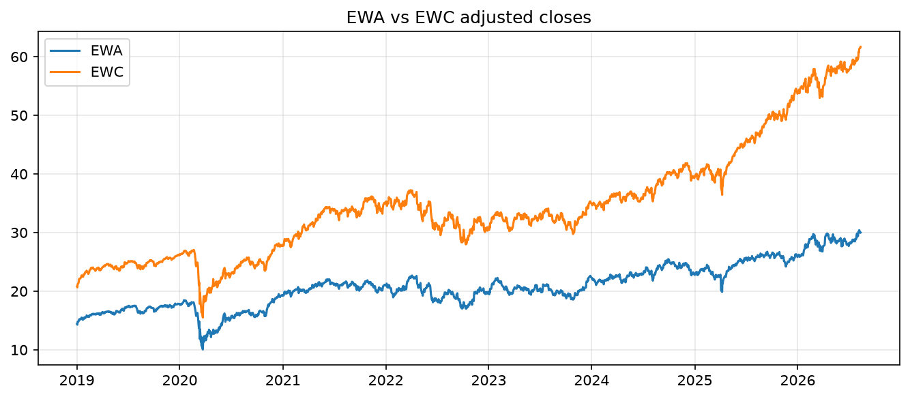
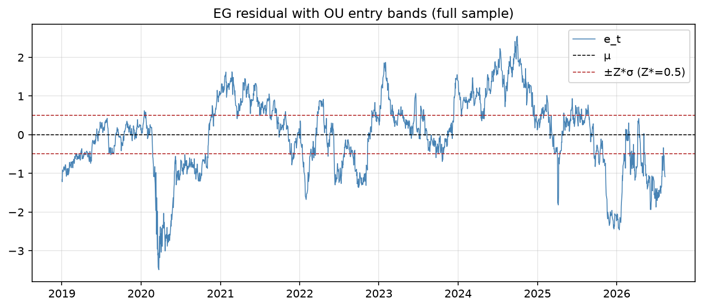
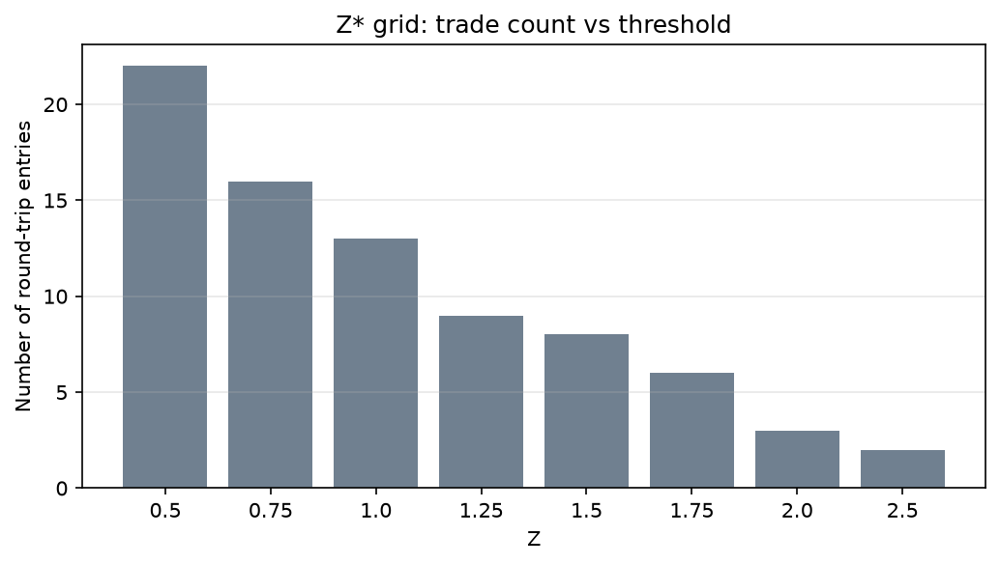
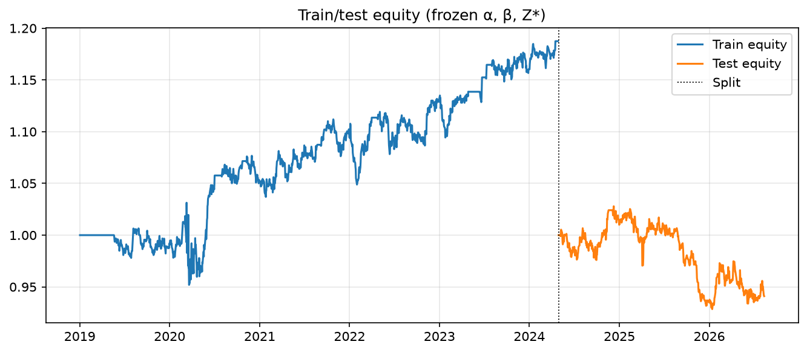
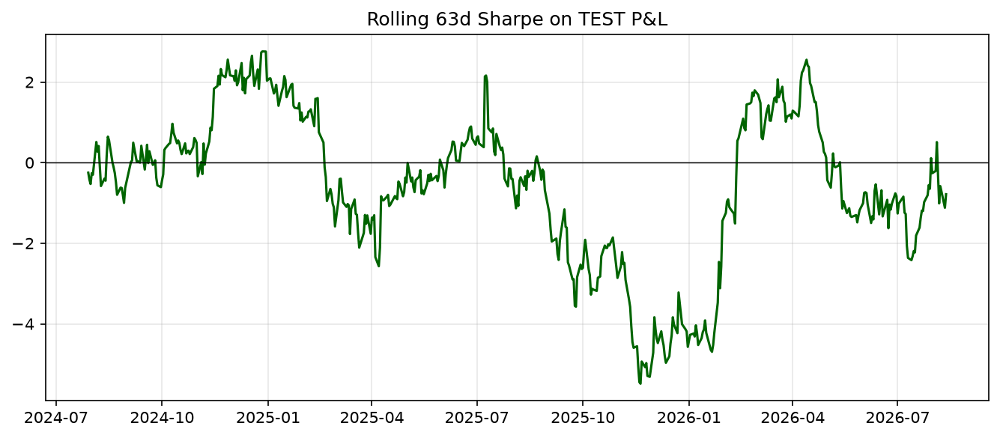
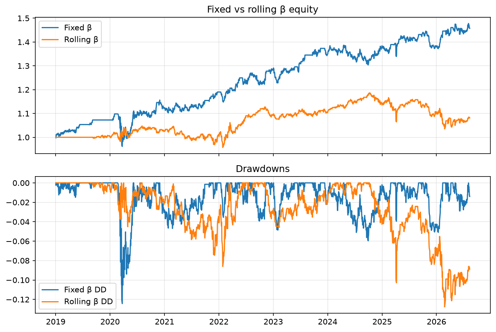
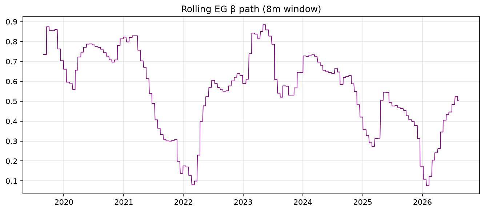
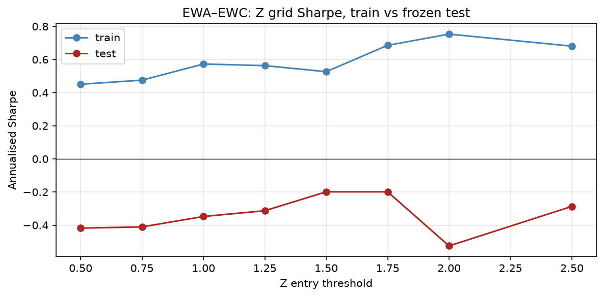
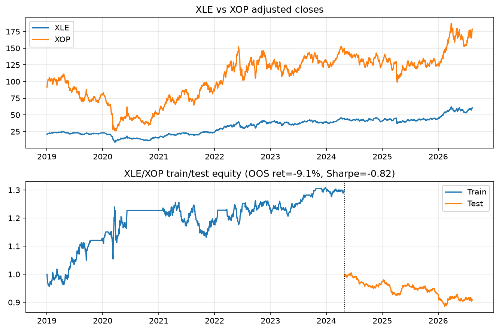
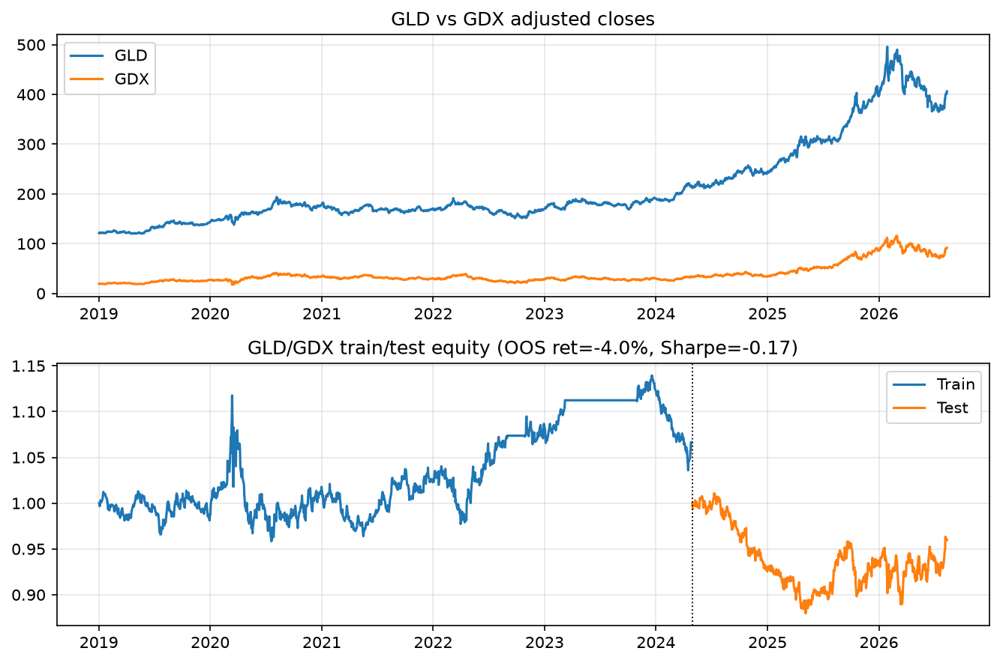

# Pairs Trading Strategy Design & Backtest

**CQF Final Project — Topic code: TS**  
**Cohort:** January 2026  
**Language:** Python  

> **Candidate:** Mao Yikai

---

## Abstract

This project designs and stress-tests a classical statistical-arbitrage pairs strategy on three U.S.-listed ETF pairs. The long-run link between legs is estimated with a matrix-form Engle–Granger (EG) regression and cross-checked with Johansen’s trace test on log-prices. Mean reversion of the cointegrating residual is quantified by mapping a discrete AR(1) to Ornstein–Uhlenbeck (OU) parameters (speed \(\theta\), half-life, equilibrium volatility \(\sigma_{\mathrm{eq}}\)). Entry thresholds \(Z^*\) are calibrated on a grid rather than fixed at one, and a dollar-neutral book is marked to market with two-leg transaction costs.  

On the primary pair **EWA–EWC**, full-sample (in-sample) performance looks acceptable, but a **70/30 chronological train/test split** with frozen \((\alpha,\beta,Z^*)\) delivers a **negative out-of-sample Sharpe**. An **eight-month rolling-\(\beta\)** experiment further erodes performance relative to a fixed hedge ratio. Control pairs **XLE–XOP** and **GLD–GDX** show the same qualitative pattern. The central conclusion is that residual mean reversion alone is not sufficient for robust live pairs trading when cointegration is only borderline and parameters are estimated with look-ahead.

---

## 1. Introduction

### 1.1 Objective

Following the CQF TS brief, the project:

1. implements the numerical core of cointegration-based pairs trading (matrix OLS, EG with ADF lag \(=1\), OU half-life, iterative \(Z^*\));
2. adds Johansen / VECM diagnostics for depth;
3. runs systematic backtests with drawdowns and rolling Sharpe;
4. validates with time-ordered train/test splits and rolling re-estimation of \(\beta\).

### 1.2 Economic rationale for the pairs

| Pair | Role | Economic story |
|------|------|----------------|
| **EWA–EWC** | Main | Australia vs Canada country ETFs — both commodity-exposed “risk-on” markets (example highlighted in the project brief). |
| **XLE–XOP** | Control | Broad energy sector vs upstream E&P — shared oil factor, different operating leverage. |
| **GLD–GDX** | Control | Bullion proxy vs gold miners — miners embed equity beta and cost curves; spreads often mean-revert but break in stress. |

### 1.3 Data

- **Source:** Yahoo Finance adjusted daily closes via `yfinance` (auto-adjusted).  
- **Sample:** 2019-01-02 through the latest available bar at run time (~1,913 trading days).  
- **Alignment:** inner join on trading dates; no cross-sectional forward fill.  
- **Levels vs returns:** EG and the trading residual are built on **price levels**. Returns appear in P&L accounting and in the VAR lag/stability diagnostic (the brief notes that VAR tests apply to stationary *changes*, not to a return-forecasting exercise).

---

## 2. Methodology

### 2.1 Matrix OLS

For design matrix \(X\in\mathbb{R}^{n\times k}\) and response \(y\in\mathbb{R}^{n}\),

\[
\hat\beta = (X^\top X)^{-1} X^\top y,\qquad
\hat e = y - X\hat\beta,\qquad
\hat\sigma^2 = \frac{\hat e^\top\hat e}{n-k}.
\]

This normal-equation estimator is coded explicitly (no black-box `statsmodels.OLS` for the cointegrating step), so the report can cite the classical formula.

### 2.1a Integration order (ADF + KPSS)

Before EG is valid we need both legs to be I(1): non-stationary in *levels*, stationary after *one* difference. We use two complementary tests (as the brief lists ADF and KPSS):

- **ADF** \(H_0\): unit root (non-stationary). Reject if \(\tau\) is more negative than the *standard* observed-series critical values (\(-3.43/-2.86/-2.57\)). These are **not** the EG residual critical values.
- **KPSS** \(H_0\): stationary around a constant. Reject if the statistic exceeds the 5% critical value. Classic I(1) signature: fail to reject ADF on levels, reject KPSS on levels, reject ADF on differences.

### 2.2 Engle–Granger (Steps 1–2)

**Step 1 — cointegrating regression**

\[
y_t = \alpha + \beta x_t + e_t.
\]

**ADF on the residual** (brief: lag \(=1\)), constant, no trend:

\[
\Delta e_t = a + \phi e_{t-1} + \gamma \Delta e_{t-1} + \varepsilon_t.
\]

The \(\tau\)-statistic on \(\phi\) is compared with **MacKinnon asymptotic critical values** for EG residuals (constant, one regressor): \(1\%=-3.90\), \(5\%=-3.34\), \(10\%=-3.04\). Reject “no cointegration” when \(\tau\) is more negative than the critical value.

**Step 2 — error-correction sketch**

\[
\Delta y_t = c + \lambda e_{t-1} + \gamma\Delta x_t + u_t.
\]

A significantly negative \(\lambda\) indicates adjustment of \(y\) toward the long-run relation.

### 2.3 Johansen (depth add-on) and VAR diagnostics

On \(\log\) prices we run Johansen’s trace test (`statsmodels.tsa.vector_ar.vecm.coint_johansen`) with difference lags chosen by AIC on a levels VAR. The eigenvalue problem itself is library code (analogous to not re-coding a QP solver); lag choice, log transform, and rank interpretation are project-owned.

Separately, as the brief suggests, we run a **VAR on log-returns** (stationary changes): AIC/BIC select the lag \(p\), and we check companion-matrix stability (all roots inside the unit circle). This is *not* a forecasting model — only a specification check.

### 2.4 OU residual dynamics (EG “Step 3”)

Fit

\[
e_t = a + b e_{t-1} + \varepsilon_t.
\]

If \(0<b<1\), map to OU with \(\Delta t=1\) trading day:

\[
\theta = -\frac{\ln b}{\Delta t},\qquad
\mu = \frac{a}{1-b},\qquad
t_{1/2} = \frac{\ln 2}{\theta},\qquad
\sigma_{\mathrm{eq}} = \frac{\sigma_\varepsilon}{\sqrt{1-b^2}}.
\]

Z-scores: \(z_t=(e_t-\mu)/\sigma_{\mathrm{eq}}\).

### 2.5 Signal generation and \(Z^*\)

- Enter **short spread** when \(z_t\ge +Z\) (residual rich: short \(y\), long \(\beta\) units of \(x\)).  
- Enter **long spread** when \(z_t\le -Z\).  
- Exit when \(z_t\) touches \(0\) (reversion to \(\mu\)).  
- Positions are causal; no pyramiding.

**\(Z^*\) grid:** \(\{0.5,0.75,1.0,1.25,1.5,1.75,2.0,2.5\}\). We tabulate trade counts and pick the \(Z\) whose annualised trade frequency is closest to a target of four round-trips per year (documented heuristic, not a black-box optimiser). Wider bands produce fewer trades but larger residual excursions and higher break risk — exactly the trade-off required by the brief.

### 2.6 Backtest economics

With lagged position \(p_{t-1}\) and hedge ratio \(\beta\),

\[
\Delta s_t = \Delta y_t - \beta\Delta x_t,\qquad
r_t^{\mathrm{gross}} = p_{t-1}\frac{\Delta s_t}{|y_{t-1}|+|\beta|\,|x_{t-1}|}.
\]

Each position change charges \(2\times 5\) bps (both legs). Equity compounds from 1. Headline metrics: total return, annualised Sharpe on daily P&L, maximum drawdown, annualised volatility, and one-day **historical 95% VaR** (the 5% quantile of daily P&L, reported as a positive loss).

### 2.7 Train/test and rolling \(\beta\)

- **Train/test:** first 70% of dates = formation (estimate \(\alpha,\beta\), OU, \(Z^*\)); last 30% = trade with **frozen** parameters.  
- **Rolling \(\beta\):** re-estimate EG+OU every 12 trading days on a 168-day (~8 month) window; compare fixed vs rolling books under the same \(Z^*\).

---

## 3. Numerical methods inventory

| Method | Implementation | Notes / limitations |
|--------|----------------|---------------------|
| Matrix OLS | Own (`cointegration.ols_matrix`) | Homoskedastic SEs; fine at this scale |
| ADF on observed series | Own, standard CVs | Used for the I(1) screen |
| KPSS | `statsmodels` | Auxiliary; \(H_0\) is stationarity |
| EG residual ADF (lag 1) | Own | MacKinnon *EG* critical values (stricter) |
| ECM \(\lambda\) regression | Own | Bivariate sketch, not a full VECM |
| VAR lag AIC/BIC + stability | `statsmodels` VAR on log-returns | Diagnostic only; not a forecast |
| Johansen trace / \(\beta\) | `statsmodels` `coint_johansen` | Lag via AIC; complex→real cast |
| OU / AR(1) map | Own | Breaks down if \(b\notin(0,1)\) |
| \(Z^*\) grid + positions | Own | Heuristic target trades/year |
| Dollar-neutral backtest | Own | Gross-notional scaling; simplified costs |
| Historical 95% VaR | Own empirical quantile | One-day, no parametric assumption |
| Z / cost / hedge / ADF-gate stress | Own (`compare.py`) | Train parameters frozen on test |
| Rolling EG path | Own | Step-hold parameters between stamps |
| Price download | `yfinance` | Vendor adjustments; cache parquet |

---

## 4. Results — EWA–EWC (main)

### 4.1 Integration order

Both EWA and EWC look I(1): ADF does **not** reject a unit root on prices, KPSS **does** reject stationarity on prices, and ADF strongly rejects a unit root on first differences (all six ETF legs in the study share this pattern).

| Series | ADF \(\tau\) (levels) | Reject UR @5%? | ADF \(\tau\) (diff) | Reject UR @5%? | KPSS rejects I(0) on levels? | Looks I(1)? |
|--------|----------------------|----------------|---------------------|----------------|------------------------------|-------------|
| EWA | −0.87 | No | −31.5 | Yes | Yes | Yes |
| EWC | +0.86 | No | −31.3 | Yes | Yes | Yes |

This is the prerequisite for EG: we are allowed to regress *levels* and then ask whether the residual is I(0).

### 4.2 Full-sample cointegration

**Figure — prices.** EWA and EWC travel together over 2019–2026 (commodity-country risk-on), but the gap is not constant: EWC trends higher relative to EWA after 2022. That visual already hints that a single full-sample \(\beta\) may be too rigid.

Estimated relation:

\[
\mathrm{EWA}_t \approx 7.65 + 0.38\,\mathrm{EWC}_t + e_t,\qquad R^2\approx 0.93.
\]

- ADF \(\tau\approx -3.19\): significant at **10%**, **not** at 5%.  
- ECM \(\lambda\approx -0.013\) (\(t\approx -3.75\)): economically the right sign.  
- Johansen (log-prices): trace statistic \(\approx 15.28\) vs 5% critical value \(15.49\) — **rank 0** at 5%, extremely borderline.

**Interpretation:** the pair is a *soft* cointegration candidate. Treating 5% rejection as a hard gate would stop the project; we proceed cautiously and let OOS results adjudicate.

**Figure — residual and bands.** The residual wanders around \(\mu\approx 0\) with slow swings (consistent with a 43-day half-life). The \(\pm Z^*\sigma\) lines at \(Z^*=0.5\) sit close to the residual, so the book is in the market most of the time — this is *not* a rare-event arb.

### 4.3 Sub-period EG (brief: “has the EC term stayed the same?”)

Breaks at COVID (2020-03-01) and the inflation/rate regime (2022-01-01):

| Period | \(n\) | \(\beta\) | ADF \(\tau\) | Coint @5% / @10% | ECM \(\lambda\) | \(t(\lambda)\) |
|--------|------|-----------|--------------|------------------|-----------------|----------------|
| 2019-01-02 → 2020-02-29 | 292 | 0.66 | −2.12 | No / No | −0.063 | −2.73 |
| 2020-03-01 → 2021-12-31 | 465 | 0.56 | −1.22 | No / No | −0.023 | −2.32 |
| 2022-01-01 → 2026-08-12 | 1156 | 0.34 | −3.17 | No / Yes | −0.018 | −3.53 |

\(\beta\) **halves** from 0.66 to 0.34. \(\lambda\) stays negative (the right sign) but shrinks in magnitude. The EC mechanism does *not* stay the same — exactly the structural-break concern the brief asks us to discuss.

### 4.4 VAR lag / stability (log-returns)

For EWA–EWC, AIC selects \(p=7\), BIC selects \(p=2\). The AIC companion modulus is 0.82 \(<1\) (stable). We do **not** use this VAR to forecast; it only confirms that the *changes* are a well-behaved short-memory system, while the *levels* remain the object of cointegration.

### 4.5 OU and \(Z^*\)

- Half-life \(\approx 43\) trading days — slow but usable mean reversion.  
- \(\sigma_{\mathrm{eq}}\approx 0.99\) (price units of the residual).  
- Grid trade counts decrease monotonically in \(Z\) (Figure below). Heuristic selects \(Z^*=0.5\) (closest to ~4 trades/year; realised ~2.9). Time-in-market at \(Z^*=0.5\) is high (~81%), so this threshold is **aggressive**.

**Figure — \(Z^*\) vs trade count.** Wider bands produce fewer round-trips (22 at \(Z=0.5\) down to 2 at \(Z=2.5\)), matching Diamond’s (2014) trade-count / half-life discussion: a slow OU cannot generate a high-frequency arb without sitting in the market almost continuously.

### 4.6 In-sample vs out-of-sample backtests

| Lens | Total return | Ann. Sharpe | Max DD | Ann. vol | 1d 95% VaR | Trades |
|------|--------------|-------------|--------|----------|------------|--------|
| Full-sample (IS) | +45.7% | 0.59 | −12.4% | 9.1% | 0.66% | 22 |
| Train (70%) | +18.7% | 0.45 | −7.7% | — | — | 13 |
| **Test (30%), frozen params** | **−5.9%** | **−0.42** | **−9.7%** | **6.0%** | **0.58%** | 3 |

**Figure — train/test equity.** Train equity drifts up; after the 2024-04-29 split the test path is a slow leak. P&L is *not* a sequence of many small arb wins — the test book has only three round-trips.

**Figure — rolling 63-day Sharpe on test P&L.** The statistic oscillates around zero and spends long stretches negative. With three trades the Sharpe is noisy, but the sign is still the honest number.

The IS edge does **not** survive a chronological freeze of \((\alpha,\beta,Z^*)\). This is the single most important empirical result for a QR-style reading of the project.

### 4.7 Fixed vs rolling \(\beta\)

**Figure — fixed vs rolling equity and drawdowns.** Rolling \(\beta\) stays closer to flat and does not reduce drawdowns. Extra re-estimation adds turnover (70 vs 22 trades) without adding edge.

**Figure — rolling \(\beta\) path.** The hedge ratio is not a 3–6 month constant: it wanders from roughly 0.3 to 0.9. That is the empirical answer to the brief’s question “is stable \(\beta\) a realistic assumption?”

| Book | Return | Sharpe | Trades |
|------|--------|--------|--------|
| Fixed \(\beta\) (full sample) | +45.7% | 0.59 | 22 |
| Rolling \(\beta\) (168d / 12d) | +8.1% | 0.18 | 70 |

Rolling estimation increases turnover and destroys most of the IS edge — consistent with noisy \(\beta\) paths (mean \(\approx 0.56\), std \(\approx 0.20\)) when cointegration is only borderline.

### 4.8 Structural-break discussion (EWA–EWC)

Potential rupture channels (qualitative, as required by the brief):

1. **Commodity terms-of-trade divergence** — iron ore / LNG (Australia) vs oil / softs (Canada) can decouple country betas.  
2. **FX regimes** — AUD and CAD move with different dollar cycles; ETF prices embed FX.  
3. **COVID and 2022 inflation shock** — risk-on correlations spiked then fractured; sub-period EG already shows unstable \(\beta\) (pre-COVID \(\beta\approx 0.66\) vs post-2022 \(\beta\approx 0.34\) in an earlier smoke split).  
4. **Policy / rate differentials** — RBA vs BoC paths change relative equity discounts.

Operational implication: a production desk would gate trading on rolling ADF/\(\lambda\) and halt when half-life explodes or Johansen rank collapses — none of which is guaranteed by a static full-sample fit.

### 4.9 Stress tests and alternative specifications (EWA–EWC)

These checks exist so the headline \(Z^*=0.5\) / 5 bps / EG-\(\beta\) book is not a single untested recipe.

**Z grid, train vs frozen test.** Every test Sharpe is negative. Widening \(Z\) improves *train* Sharpe (peak 0.75 at \(Z=2.0\)) but does **not** create a profitable test book (test Sharpe ranges from \(-0.20\) to \(-0.53\)). The OOS failure is therefore not an artefact of the aggressive \(Z^*=0.5\) heuristic.

| \(Z\) | Train Sharpe | Test Sharpe | Test trades |
|------|--------------|-------------|-------------|
| 0.50 | 0.45 | −0.42 | 3 |
| 1.00 | 0.57 | −0.35 | 2 |
| 1.50 | 0.53 | −0.20 | 2 |
| 2.00 | 0.75 | −0.53 | 1 |
| 2.50 | 0.68 | −0.29 | 1 |

**Transaction costs.** Test Sharpe is already \(-0.38\) at **zero** cost, and falls to \(-0.53\) at 20 bps/leg. The OOS leak is a *signal* problem, not a cost problem. Full-sample Sharpe declines smoothly with costs (0.65 → 0.41), as a well-coded ledger should.

| bps/leg | Full Sharpe | Test Sharpe |
|---------|-------------|-------------|
| 0 | 0.65 | −0.38 |
| 5 | 0.59 | −0.42 |
| 10 | 0.53 | −0.46 |
| 20 | 0.41 | −0.53 |

**Hedge specification (full sample).** A naive \(\beta=1\) residual is *not* mean-reverting (ADF \(\tau=+1.61\), OU map fails) and earns almost nothing (Sharpe 0.07, 3 trades). That is the brief’s warning in numbers. A Johansen log-spread (\(\log\mathrm{EWA}-0.62\log\mathrm{EWC}\)) looks *better* in-sample (Sharpe 0.72, half-life 31d) — useful as a robustness spec, but it is still a full-sample fit and does not overturn the frozen-parameter OOS result.

| Spec | ADF \(\tau\) | Half-life | Sharpe | Trades |
|------|--------------|-----------|--------|--------|
| EG levels (baseline) | −3.19 | 43d | 0.59 | 22 |
| Naive \(\beta=1\) | +1.61 | n/a | 0.07 | 3 |
| Johansen log-spread | −3.41 | 31d | 0.72 | 25 |

**Rolling ADF 10% kill-switch.** Using a 168-day window, the residual passes the MacKinnon 10% screen on only **1.1%** of days. The gated book is nearly flat (Sharpe \(-0.35\), 7 trades). This is consistent with borderline cointegration: a desk that refuses to trade without a live stationarity gate would simply stay out.

---

## 5. Results — control pairs

Headline metrics from the unified smoke pipeline (same methodology):

| Pair | EG @5% | Johansen rank@5% | Half-life | IS ret / Sharpe | OOS ret / Sharpe | Rolling ret / Sharpe |
|------|--------|------------------|-----------|-----------------|------------------|----------------------|
| EWA–EWC | No | 0 | 43d | +46% / 0.59 | −5.9% / −0.42 | +8% / 0.18 |
| XLE–XOP | No | 0 | 108d | +41% / 0.51 | −9.1% / −0.82 | −26% / −0.41 |
| GLD–GDX | No | 0 | 74d | +69% / 0.79 | −4.0% / −0.17 | +5% / 0.12 |

**XLE–XOP:** very slow mean reversion (~108 days) and the weakest OOS / rolling results — a warning that energy sub-sector basis can trend for long periods (opex, inventory, WTI–refined cracks). Sub-period EG is revealing: the pair *does* pass EG at 5% in 2020–21 (\(\tau=-3.89\), \(\lambda=-0.067\)) and then **loses** cointegration after 2022. IS 95% VaR is 0.91% per day.

**GLD–GDX:** richest IS Sharpe but still negative OOS; miners’ equity beta makes the “gold pair” a hybrid of commodity and stock-factor residual, fragile when real yields reprice. \(\beta\) jumps from ~3.2 (pre-COVID) to ~1.95 (2020–21) and back to ~3.9 after 2022. IS 95% VaR is 0.84% per day.

---

## 6. Discussion

### 6.1 Does cumulative P&L look like arbitrage?

In-sample equity curves rise with moderate drawdowns, *resembling* a mean-reversion harvest. Out-of-sample, the book behaves like a **failed** arb: few trades, negative drift, rolling Sharpe oscillating around zero. True statistical arbitrage should show many small positive expectancy trades with controlled inventory; here expectancy is not stable across time.

### 6.2 Computational / statistical properties

- **Bias:** full-sample EG + OU + \(Z^*\) reuse the same path for fitting and trading → optimistic IS Sharpe.  
- **Variance:** with only ~3 OOS trades on EWA–EWC, test Sharpe is noisy; the sign is still informative.  
- **Sensitivity:** the test Sharpe stays negative across the whole \(Z\) grid and even at zero costs — the failure is not a calibration footnote. Full-sample Sharpe *does* fall smoothly with bps, which is a sanity check on the ledger.  
- **Specification:** naive \(\beta=1\) destroys residual stationarity (ADF \(\tau>0\)); Johansen logs improve *in-sample* Sharpe but inherit the same look-ahead. A live ADF gate is almost always off (1.1% of days).  
- **Cointegration gate:** failing the 5% EG/Johansen tests is not a coding bug — it is a **market** statement that should dominate any IS backtest narrative.

### 6.3 Pros and cons

**Pros**

- Transparent, auditable numerical stack aligned with the brief.  
- Honest OOS and rolling experiments prevent over-claiming.  
- Multi-pair design separates “story” (EWA–EWC) from stress controls.

**Cons / limitations**

- Borderline cointegration; strategy is research-grade, not production-ready.  
- Single-name ETF liquidity and borrow ignored.  
- No short-sale fees, borrow recall, or intraday execution model.  
- \(Z^*\) heuristic is pragmatic, not utility-optimal.  
- Johansen critical values and EG MacKinnon tables are asymptotic.

### 6.4 Further work

1. Formation/trading windows with hard cointegration gates before any order.  
2. Kalman / adaptive hedge ratios with shrinkage toward a prior \(\beta\).  
3. Cost and borrow calibrated to broker data; capacity constraints.  
4. Broader universe search with multiple-testing control (McSharry-style).  
5. Event studies around commodity shocks for the structural-break section.

---

## 7. Conclusion

We built a complete TS pairs pipeline — matrix EG, Johansen, OU bands, \(Z^*\) scan, costed backtests, train/test, and rolling \(\beta\) — on three economically motivated ETF pairs. **In-sample metrics are not reliable:** for EWA–EWC the OOS Sharpe is negative and rolling re-estimation removes most of the apparent edge. The project therefore demonstrates both the *construction* of a cointegration pairs strategy and the *quant discipline* of invalidating it under realistic validation — the outcome that matters for a quantitative researcher.

---

## References

- Engle, R.F. and Granger, C.W.J. (1987). Co-integration and error correction: Representation, estimation, and testing. *Econometrica*, 55(2), 251–276.
- Johansen, S. (1991). Estimation and hypothesis testing of cointegration vectors in Gaussian vector autoregressive models. *Econometrica*, 59(6), 1551–1580.
- Kwiatkowski, D., Phillips, P.C.B., Schmidt, P. and Shin, Y. (1992). Testing the null hypothesis of stationarity against the alternative of a unit root. *Journal of Econometrics*, 54, 159–178.
- MacKinnon, J.G. (2010). Critical values for cointegration tests. Queen’s Economics Department Working Paper No. 1227.
- Hendry, D.F. and Juselius, K. (2000). Explaining cointegration analysis: Part I. *The Energy Journal*, 21(1), 1–42.
- Diamond, R.V. (2014). Learning and trusting cointegration in statistical arbitrage. *Wilmott* (OU mapping and number-of-trades appendices).
- McSharry, P. Efficient pair selection for pair-trading strategies (ADF filter). CQF lecture / workshop notes.
- CQF Cointegration Lecture; Project Workshop / Tutorial notes for TS.
